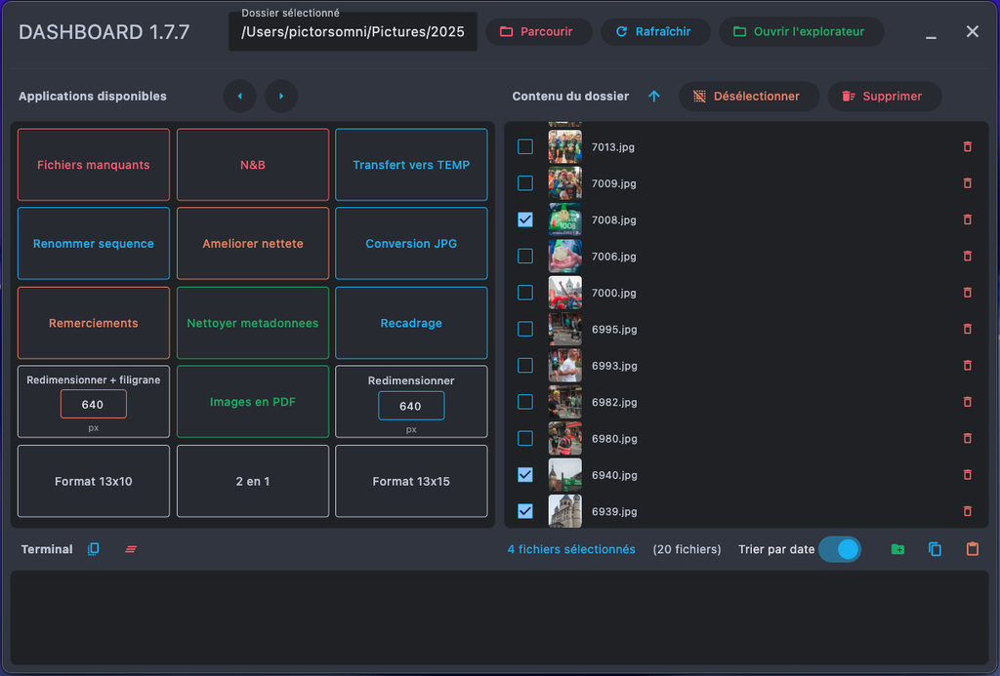
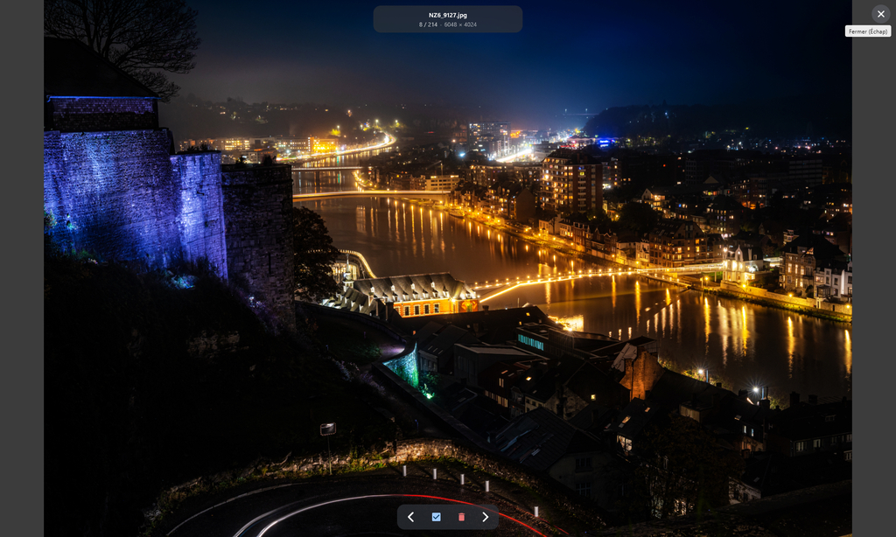

# 📸 Dashboard Image Manipulation

Application de gestion et manipulation d'images avec interface graphique.  
Compatible **Windows**, **macOS** et **Linux**.




---

## 🚀 Installation rapide

### Windows
```cmd
install.bat
```

### Linux / macOS
```bash
chmod +x install.sh run.sh update.sh
./install.sh
```

---

## ▶️ Lancement

### Méthode 1 : Lanceur automatique (recommandé)

**Windows :**
```cmd
run.bat
```

**Linux / macOS :**
```bash
./run.sh
```

### Méthode 2 : Python direct
```bash
python Dashboard.pyw
```
*ou*
```bash
python3 Dashboard.pyw
```

---

## 🔄 Mise à jour du projet (Git)

### Windows
```cmd
update.bat
```

### Linux / macOS
```bash
./update.sh
```

Ces scripts font `git pull` **uniquement si** :
- le dossier est un dépôt Git valide,
- le script est lancé depuis la racine du dépôt,
- le remote `origin` correspond à l'adresse attendue du projet.

Sinon, ils s'arrêtent avec un message d'erreur explicite.

---

## 📋 Prérequis

- **Python 3.8+** : [Télécharger Python](https://www.python.org/downloads/)
- **ImageMagick** (optionnel mais recommandé pour la conversion d'images) :
  - **Windows** : [Télécharger ImageMagick](https://imagemagick.org/script/download.php#windows)
  - **macOS** : `brew install imagemagick`
  - **Linux** : `sudo apt install imagemagick` (Debian/Ubuntu) ou `sudo dnf install ImageMagick` (Fedora)

---

## 📦 Dépendances Python

Les dépendances sont installées automatiquement par `install.sh` ou `install.bat`.  
Pour une installation manuelle :

```bash
pip install -r requirements.txt
```

**Packages requis :**
- `flet` : Interface graphique
- `Pillow` : Traitement d'images
- `Wand` : Conversion d'images (requiert ImageMagick)
- `rich` : Interface console améliorée

---

## 📂 Structure du projet

```
Dashboard-Image-Manipulation/
├── Dashboard.pyw         # Application principale
├── run.py                # Lanceur universel Python
├── run.sh                # Lanceur Linux/macOS
├── run.bat               # Lanceur Windows
├── update.sh             # Mise à jour Git Linux/macOS
├── update.bat            # Mise à jour Git Windows
├── install.sh            # Installation Linux/macOS
├── install.bat           # Installation Windows
├── requirements.txt      # Dépendances Python
├── README.md             # Ce fichier
└── Data/                 # Applications et ressources
    ├── watermark.png     # Filigrane utilisé par certaines apps
   ├── 2 en 1.py
   ├── Ameliorer nettete.py
   ├── Conversion JPG.py
   ├── Fichiers manquants.py
   ├── Format 13x10.py
   ├── Format 13x15.py
   ├── Images en PDF.py
   ├── Kiosk droite.py
   ├── Kiosk gauche.py
   ├── N&B.py
   ├── Nettoyer metadonnees.py
    ├── Remerciements.py
   ├── Redimensionner.py
   ├── Redimensionner filigrane.py
   ├── Recadrage.pyw
    ├── Renommer sequence.py
    ├── renommer nombre photo.py
   └── Transfert vers TEMP.py
```

---

## 🎯 Fonctionnalités

- **Interface graphique moderne** avec Flet
- **Navigation dans les dossiers** avec prévisualisation
- **Lancement rapide d'applications** de traitement d'images
- **Gestion des fichiers** (sélection, suppression, ouverture, création de dossiers, copier/coller...)
- **Support multi-plateforme** (Windows, macOS, Linux)
- **Applications portables** : les apps sont copiées temporairement dans le dossier de travail

---

## 🔧 Utilisation

1. Lancez le Dashboard avec `run.bat` (Windows) ou `./run.sh` (Linux/macOS)
2. Sélectionnez un dossier contenant vos images avec le bouton **Parcourir**
3. Vous pouvez soit selectionner les images a utiliser, soit ne rien selectionner, auquel cas, tous les fichiers image du dossiers seront utilisés
4. Cliquez sur une application dans la liste pour la lancer
5. L'application sera copiée dans le dossier sélectionné et lancée automatiquement
6. Une fois terminée, le fichier temporaire est supprimé automatiquement

---

## 📝 Applications disponibles

| Nom affiché (Dashboard) | Script | Description | Nécessite un dossier |
|-------------------------|--------|-------------|---------------------|
| 2 en 1 | `2 en 1.py` | Combine deux images côte à côte | ✅ |
| Nettoyer les métadonnées | `Nettoyer metadonnees.py` | Supprime les métadonnées EXIF | ✅ |
| Conversion en JPG | `Conversion JPG.py` | Convertit les images en JPG | ✅ |
| Fichiers manquants | `Fichiers manquants.py` | Détecte les fichiers manquants | ✅ |
| Format 13x10 | `Format 13x10.py` | Recadre en format 13x10 cm | ✅ |
| Format 13x15 | `Format 13x15.py` | Recadre en format 13x15 cm | ✅ |
| Images en PDF | `Images en PDF.py` | Génère un PDF à partir d'images | ✅ |
| Noir et blanc | `N&B.py` | Conversion noir et blanc | ✅ |
| Recadrage | `Recadrage.pyw` | Outil de recadrage interactif | ✅ |
| Remerciements | `Remerciements.py` | Génère des cartes de remerciement | ✅ |
| Redimensionner | `Redimensionner.py` | Redimensionne les images (taille paramétrable) | ✅ |
| Redimensionner + filigrane | `Redimensionner filigrane.py` | Redimensionne avec filigrane (taille paramétrable) | ✅ |
| Renommer nombre photo | `renommer nombre photo.py` | Renomme selon un pattern | ✅ |
| Renommer en séquence | `Renommer sequence.py` | Renomme en séquence numérotée | ✅ |
| Améliorer la netteté | `Ameliorer nettete.py` | Améliore la netteté des images | ✅ |
| Transfert vers TEMP | `Transfert vers TEMP.py` | Envoie des fichiers vers un dossier TEMP prédéfini | ❌ |
| Kiosk droite | `Kiosk droite.py` | Organise les fichiers kiosque droite | ❌ |
| Kiosk gauche | `Kiosk gauche.py` | Organise les fichiers kiosque gauche | ❌ |

---

## 🛠️ Distribution portable

Pour distribuer l'application sur une autre machine :

1. **Compresser le dossier complet** en ZIP :
   ```
   Dashboard-Image-Manipulation.zip
   ```

2. **Décompresser sur la machine cible**

   ⚠️ Si vous voulez utiliser `update.bat` / `update.sh`, copiez aussi le dossier caché `.git`
   (ou faites un `git clone` sur la machine cible).

3. **Lancer l'installation** :
   - Windows : double-clic sur `install.bat`
   - Linux/macOS : `./install.sh` dans un terminal

4. **Lancer l'application** :
   - Windows : double-clic sur `run.bat`
   - Linux/macOS : `./run.sh`

---

## ⚠️ Dépannage

### "Python n'est pas reconnu..."
→ Python n'est pas installé ou pas dans le PATH  
→ Réinstallez Python en cochant "Add Python to PATH"

### "ImportError: No module named 'flet'"
→ Les dépendances ne sont pas installées  
→ Lancez `install.bat` (Windows) ou `./install.sh` (Linux/macOS)

### "ImageMagick introuvable"
→ ImageMagick n'est pas installé (optionnel)  
→ Les apps de conversion JPG peuvent ne pas fonctionner  
→ Installez ImageMagick depuis les liens ci-dessus

### Les scripts .sh ne se lancent pas (Linux/macOS)
→ Rendez-les exécutables :
```bash
chmod +x install.sh run.sh update.sh
```

### "[ERREUR] Mauvais depot distant configure" avec update
→ Le remote `origin` ne correspond pas au dépôt attendu
→ Vérifiez avec `git remote -v` puis corrigez si besoin

---

## 📄 Licence

Ce projet est sous licence libre. Vous pouvez l'utiliser, le modifier et le distribuer librement.

---

## 👤 Auteur

Créé avec ❤️ pour simplifier le traitement d'images en lots.
