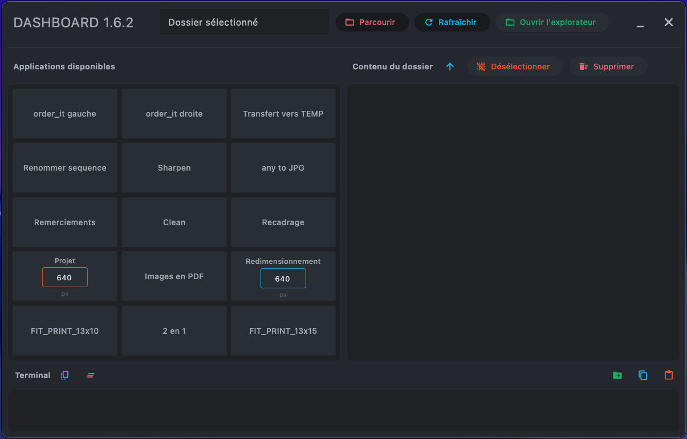

# 📸 Dashboard Image Manipulation

Application de gestion et manipulation d'images avec interface graphique.  
Compatible **Windows**, **macOS** et **Linux**.



---

## 🚀 Installation rapide

### Windows
```cmd
install.bat
```

### Linux / macOS
```bash
chmod +x install.sh run.sh
./install.sh
```

---

## ▶️ Lancement

### Méthode 1 : Lanceur automatique (recommandé)

**Windows :**
```cmd
run.bat
```

**Linux / macOS :**
```bash
./run.sh
```

### Méthode 2 : Python direct
```bash
python Dashboard.py
```
*ou*
```bash
python3 Dashboard.py
```

---

## 📋 Prérequis

- **Python 3.8+** : [Télécharger Python](https://www.python.org/downloads/)
- **ImageMagick** (optionnel mais recommandé pour la conversion d'images) :
  - **Windows** : [Télécharger ImageMagick](https://imagemagick.org/script/download.php#windows)
  - **macOS** : `brew install imagemagick`
  - **Linux** : `sudo apt install imagemagick` (Debian/Ubuntu) ou `sudo dnf install ImageMagick` (Fedora)

---

## 📦 Dépendances Python

Les dépendances sont installées automatiquement par `install.sh` ou `install.bat`.  
Pour une installation manuelle :

```bash
pip install -r requirements.txt
```

**Packages requis :**
- `flet` : Interface graphique
- `Pillow` : Traitement d'images
- `Wand` : Conversion d'images (requiert ImageMagick)
- `rich` : Interface console améliorée

---

## 📂 Structure du projet

```
Dashboard-Image-Manipulation/
├── Dashboard.py          # Application principale
├── run.py                # Lanceur universel Python
├── run.sh                # Lanceur Linux/macOS
├── run.bat               # Lanceur Windows
├── install.sh            # Installation Linux/macOS
├── install.bat           # Installation Windows
├── requirements.txt      # Dépendances Python
├── README.md             # Ce fichier
└── Data/                 # Applications et ressources
    ├── watermark.png     # Filigrane utilisé par certaines apps
    ├── 2-in-1.py
    ├── Clean.py
    ├── FIT_PRINT_13x10.py
    ├── FIT_PRINT_13x15.py
    ├── Polaroid.py
    ├── Projet.py
    ├── Remerciements.py
    ├── sharpen.py
    ├── any to JPG.py
    ├── jpeg 2 jpg.py
    ├── Renommer sequence.py
    ├── renommer nombre photo.py
    ├── order_it droite.py
    ├── order_it gauche.py
    └── Copy remaining files.py
```

---

## 🎯 Fonctionnalités

- **Interface graphique moderne** avec Flet
- **Navigation dans les dossiers** avec prévisualisation
- **Lancement rapide d'applications** de traitement d'images
- **Gestion des fichiers** (suppression, ouverture)
- **Support multi-plateforme** (Windows, macOS, Linux)
- **Applications portables** : les apps sont copiées temporairement dans le dossier de travail

---

## 🔧 Utilisation

1. Lancez le Dashboard avec `run.bat` (Windows) ou `./run.sh` (Linux/macOS)
2. Sélectionnez un dossier contenant vos images avec le bouton **Parcourir**
3. Cliquez sur une application dans la liste pour la lancer
4. L'application sera copiée dans le dossier sélectionné et lancée automatiquement
5. Une fois terminée, le fichier temporaire est supprimé automatiquement

---

## 📝 Applications disponibles

| Application | Description | Nécessite un dossier |
|------------|-------------|---------------------|
| `2-in-1.py` | Combine deux images côte à côte | ✅ |
| `Clean.py` | Supprime les métadonnées EXIF | ✅ |
| `FIT_PRINT_13x10.py` | Recadre en format 13x10 cm | ✅ |
| `FIT_PRINT_13x15.py` | Recadre en format 13x15 cm | ✅ |
| `Polaroid.py` | Crée un effet Polaroid | ✅ |
| `Projet.py` | Redimensionne et ajoute un filigrane | ✅ |
| `Remerciements.py` | Génère des cartes de remerciement | ✅ |
| `sharpen.py` | Améliore la netteté des images | ✅ |
| `any to JPG.py` | Convertit divers formats en JPG | ✅ |
| `jpeg 2 jpg.py` | Renomme .jpeg en .jpg | ✅ |
| `Renommer sequence.py` | Renomme en séquence numérotée | ✅ |
| `renommer nombre photo.py` | Renomme selon un pattern | ✅ |
| `order_it droite.py` | Organise les fichiers kiosk droite | ❌ |
| `order_it gauche.py` | Organise les fichiers kiosk gauche | ❌ |
| `Copy remaining files.py` | Copie les fichiers manquants | ❌ |

---

## 🛠️ Distribution portable

Pour distribuer l'application sur une autre machine :

1. **Compresser le dossier complet** en ZIP :
   ```
   Dashboard-Image-Manipulation.zip
   ```

2. **Décompresser sur la machine cible**

3. **Lancer l'installation** :
   - Windows : double-clic sur `install.bat`
   - Linux/macOS : `./install.sh` dans un terminal

4. **Lancer l'application** :
   - Windows : double-clic sur `run.bat`
   - Linux/macOS : `./run.sh`

---

## ⚠️ Dépannage

### "Python n'est pas reconnu..."
→ Python n'est pas installé ou pas dans le PATH  
→ Réinstallez Python en cochant "Add Python to PATH"

### "ImportError: No module named 'flet'"
→ Les dépendances ne sont pas installées  
→ Lancez `install.bat` (Windows) ou `./install.sh` (Linux/macOS)

### "ImageMagick introuvable"
→ ImageMagick n'est pas installé (optionnel)  
→ L'app "any to JPG" ne fonctionnera pas  
→ Installez ImageMagick depuis les liens ci-dessus

### Les scripts .sh ne se lancent pas (Linux/macOS)
→ Rendez-les exécutables :
```bash
chmod +x install.sh run.sh
```

---

## 📄 Licence

Ce projet est sous licence libre. Vous pouvez l'utiliser, le modifier et le distribuer librement.

---

## 👤 Auteur

Créé avec ❤️ pour simplifier le traitement d'images en lots.
