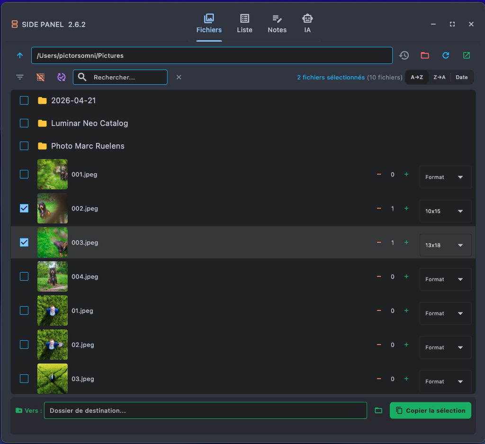
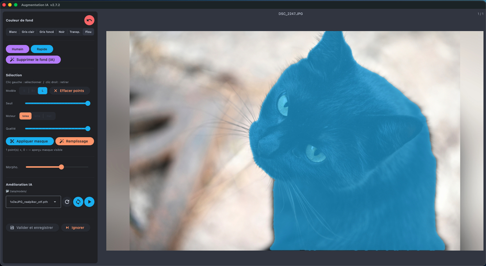
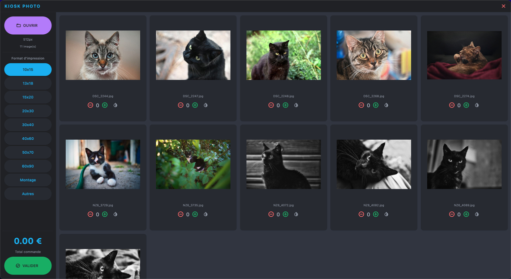

# Dashboard Image Manipulation

Application de gestion et manipulation d'images avec interface graphique.  
Compatible **Windows**, **macOS** et **Linux**.






---

## Résumé utilisateur

Dashboard est un poste de travail tout-en-un pour trier, préparer, retoucher et exporter des photos en série, sans quitter la même interface.

### Ce que vous pouvez faire au quotidien

- **Parcourir et trier vos dossiers** : navigation, recherche, tri A→Z / Z→A / date, pagination, favoris, périphériques amovibles.
- **Sélectionner vos images** : sélection multiple, inversion, filtrage, copier/couper/coller, copie dans un dossier SELECTION, suppression, renommage.
- **Ouvrir les images en plein écran** : navigation clavier, rotation, suppression directe depuis la visionneuse.
- **Lancer les outils de production en un clic** : recadrage, redimensionnement, conversion JPG, 2-en-1, PDF, noir et blanc, netteté, métadonnées, tri RAW/JPG, impression, etc.
- **Utiliser des apps connexes intégrées** : Side Panel (utilitaires fichiers/listes), Comparaison (deux dossiers côte à côte), Kiosk (flux d'impression).
- **Déléguer à l'IA** : l'assistant peut gérer vos fichiers, analyser vos images, naviguer dans vos dossiers, sélectionner des photos selon des critères visuels, générer et modifier des images, écrire du code — tout depuis le chat.
- **Prendre des notes et éditer du code** : éditeur de code intégré avec coloration syntaxique, lecture/écriture accessible depuis l'IA.

### Points forts

- **Pensé pour le volume** : traitement par lots, automatisations, scripts spécialisés photo.
- **IA autonome** : l'assistant peut naviguer, sélectionner, créer, déplacer et supprimer des fichiers sans sortir de l'interface.
- **Multi-plateforme** : Windows, macOS et Linux.
- **Local-first** : vos images restent sur votre machine. Possibilité d'utiliser des modèles locaux via Ollama (Gemma, etc.).

---

## Fonctionnalités

### Gestion de fichiers

| Fonctionnalité | Description |
|---|---|
| Navigation | Parcourir les dossiers, accéder aux favoris, aux volumes montés et aux périphériques amovibles |
| Recherche | Recherche en temps réel par nom de fichier dans la prévisualisation |
| Tri | A→Z, Z→A, par date (croissant/décroissant) |
| Sélection | Multiple, inversion, tout sélectionner, filtrer sur la sélection, sélectionner par date |
| Copier/Coller | Copier ou couper une sélection, coller dans un autre dossier |
| Copie SELECTION | Copier la sélection dans un sous-dossier `SELECTION` en un clic |
| Dossiers | Créer, renommer, supprimer |
| ZIP | Double-cliquer sur un .zip pour extraire ; compresser depuis l'IA |
| Renommage en séquence | Script de renommage numérique en séquence |

### Outils de production

| Outil | Description |
|---|---|
| Recadrage manuel | Recadrage interactif avec formats photo professionnels (mm ou pixels personnalisables), suppression de fond par IA (rembg), planches ID |
| Recadrage automatique | Recadrage automatique (mode fit ou crop) vers un format cible |
| Redimensionner | Redimensionnement en lot (dimension max, qualité JPEG) |
| Redimensionner + filigrane | Redimensionnement avec incrustation de filigrane |
| Conversion JPG | Conversion de formats divers (PNG, TIFF, BMP…) vers JPG |
| Images en PDF | Assembler une sélection d'images en un seul PDF |
| 2-en-1 | Composer deux tirages identiques sur une feuille (ex. 2 × 10x15 sur 15x20) |
| Fit 203 | Placer une image dans un format supérieur avec bords blancs |
| Noir et blanc | Conversion N&B en lot |
| Netteté | Amélioration de la netteté en lot |
| Débruitage | Réduction du bruit par algorithme Non-Local Means (OpenCV NLM), configurable en intensité |
| Grain pellicule | Simulation de grain argentique sur deux passes indépendantes, avec pondération par luminance, halation, aberrations chromatiques, bloom, désaturation des extrêmes et courbes tonales. Intensité, taille (en % de l'image) et part chromatique réglables par passe. |
| Augmentation IA | Inpainting interactif (sélection au lasso d'une zone, modification par Gemini) et outpainting (extension du cadre par Gemini) |
| Métadonnées | Nettoyage ou copie des métadonnées EXIF |
| Tri RAW/JPG | Séparer automatiquement les fichiers RAW et JPG |
| Copier NEFs de la sélection | Copier les RAW correspondant aux JPG sélectionnés |
| Impression | Fichiers d'impression avec compteur de copies par image |
| Transfert vers TEMP | Copier/déplacer la sélection vers le dossier TEMP réseau (avec confirmation) |
| Copyright | Ajouter un copyright en filigrane |
| Remerciements | Génération de tirages de remerciements personnalisés |
| Nettoyer anciens fichiers | Supprimer les fichiers plus vieux que N jours |
| Fichiers identiques / manquants | Comparer deux dossiers |

### Apps connexes

| App | Description |
|---|---|
| Side Panel | Panneau latéral : utilitaires de fichiers, listes, outils complémentaires |
| Comparaison | Visualiser deux dossiers côte à côte pour valider une sélection |
| Kiosk gauche / droite | Flux d'impression pour bornes photo (HotFolder → réseau) |
| Kiosk Flet | Interface Kiosk complète avec gestion des tarifs et commandes |

### Assistant IA

L'IA (Gemini par défaut, ou modèles Ollama locaux) est intégrée directement dans le Dashboard.

#### Capacités générales
- Chat texte et analyse d'images jointes
- Lecture de fichiers (`.txt`, `.md`, `.py`, `.json`, `.pdf`, `.docx`, `.csv`…)
- Recherche web (DuckDuckGo ou Google natif pour Gemini)
- Lecture d'URLs
- Mémoire persistante entre sessions (`memory.md`, `user.md`, `skills.md`)
- **Fallback automatique** : Gemini 3.5 Flash → Gemini 3.1 Pro (quota/indispo) → Gemma local (hors-ligne)

#### Outils fichiers (autonomes)
| Outil IA | Description |
|---|---|
| `list_folder_contents` | Lister le contenu d'un dossier avec taille et date |
| `read_file_content` | Lire le contenu d'un fichier texte |
| `create_file` | Créer ou modifier un fichier (crée les sous-dossiers si besoin) |
| `delete_files` | Supprimer des fichiers/dossiers (confirmation par défaut) |
| `move_file` | Déplacer ou renommer un fichier/dossier |
| `copy_file` | Copier un fichier ou dossier (récursif) |
| `create_folder` | Créer un dossier (mkdir -p) |
| `read_exif` | Lire les métadonnées EXIF (date, appareil, objectif, GPS…) |
| `zip_files` | Créer une archive ZIP |
| `unzip_file` | Extraire une archive ZIP |
| `organize_files` | Déplacer des fichiers vers des sous-dossiers thématiques |
| `analyze_images` | Analyser visuellement les images du dossier (chercher des critères) |
| `generate_image` | Générer une image depuis un prompt texte (Gemini image generation) |
| `edit_image` | Modifier une image existante via prompt texte |
| `generate_music` | Générer un morceau de musique via Lyria 3 (30 s ou ~2 min) — sauvegardé en MP3 dans le dossier ouvert |
| `edit_file` | Remplacement chirurgical `old_string → new_string` dans un fichier (sans réécrire le fichier entier) |
| `search_in_files` | Recherche regex récursive dans les fichiers, avec filtre glob et sensibilité à la casse |
| `find_files` | Recherche de fichiers par motif glob (`*.py`, `rapport*.pdf`…) |
| `git_command` | Commandes Git : status, log, diff, add, commit, push, pull, checkout… (liste blanche) |
| `manage_tasks` | Todo-list persistante en JSON (`.tasks.json`) avec états todo / in-progress / done |
| `read_pdf` | Extraction de texte PDF page par page (PyMuPDF prioritaire, pypdf en fallback) |
| `ask_subagent` | Déléguer une tâche à une instance IA distincte sans outils (recherche, synthèse, rédaction) |
| `schedule_task` | Planificateur OS — `schtasks` (Windows) / `crontab` (Linux-macOS) |
| `http_request` | Requêtes HTTP GET/POST/PUT/DELETE/PATCH avec headers et body personnalisés |
| `read_spreadsheet` | Lecture structurée de fichiers CSV, `.xlsx`, `.xls` et `.ods` |
| `run_terminal_command` | Exécuter des commandes shell (confirmation avant exécution) |

#### Outils interface
| Outil IA | Description |
|---|---|
| `navigate_to_folder` | Ouvrir un dossier dans le navigateur de fichiers |
| `select_files_in_ui` | Sélectionner ou désélectionner des fichiers dans l'interface |
| `read_notepad` | Lire le contenu du bloc-notes intégré |
| `write_notepad` | Écrire dans le bloc-notes (remplacer, ajouter au début ou à la fin) |

#### Synthèse vocale (TTS)
- Lecture automatique des réponses ou à la demande (bouton dédié)
- Mode **Live** (Gemini Live — voix naturelle et conversationnelle)
- Mode **Chunked** (lecture fidèle du texte, tous modèles)
- 10 voix au choix (Kore, Puck, Charon, Fenrir, Aoede, Leda, Orus, Zephyr, Schedar, Gacrux)

#### Modèles disponibles
| Modèle | Type | Vision |
|---|---|---|
| Gemini 3.5 Flash | Cloud Google | Oui |
| Gemini 3.1 Pro | Cloud Google | Oui |
| Claude Sonnet 4.6 | Cloud Anthropic | Oui |
| Gemma 4 E4B MLX (~9.6 GB) | Local Ollama (Apple Silicon) | Non |
| Gemma 4 · E4B (~9.6 GB) | Local Ollama | Oui |
| Gemma 4 · 12B (~7.6 GB) | Local Ollama | Oui |

---

## Raccourcis clavier

### Dashboard (global)

| Raccourci | Action |
|---|---|
| Ctrl/Cmd + Haut | Agrandir ou réduire la zone basse |
| Ctrl/Cmd + Bas | Basculer entre Terminal et IA + Notes |
| Esc | Revenir au mode Terminal depuis IA/Notes |

### Gestion de fichiers

| Raccourci | Action |
|---|---|
| Ctrl/Cmd + A | Sélectionner / désélectionner tout |
| Ctrl/Cmd + I | Inverser la sélection |
| Ctrl/Cmd + C | Copier la sélection |
| Ctrl/Cmd + X | Couper la sélection |
| Ctrl/Cmd + V | Coller dans le dossier courant |
| Ctrl/Cmd + N | Créer un nouveau dossier |
| Ctrl/Cmd + R | Rafraîchir la prévisualisation |
| Ctrl/Cmd + D | Sélectionner tous les fichiers de la même date que le fichier de référence sélectionné |
| Delete / Backspace | Supprimer la sélection |

### IA et Notes

| Raccourci | Action |
|---|---|
| Ctrl/Cmd + Flèche gauche | IA seule en mode colonne (preview à droite) |
| Ctrl/Cmd + Flèche droite | Bloc-notes seul en mode colonne (preview à droite) |
| Ctrl/Cmd + Shift + Flèche gauche | IA en plein écran (moins la barre du haut) |
| Ctrl/Cmd + Shift + Flèche droite | Bloc-notes en plein écran (moins la barre du haut) |

### Visionneuse plein écran

| Raccourci | Action |
|---|---|
| Flèche gauche / droite | Image précédente / suivante |
| [ / ] | Rotation gauche / droite |
| Delete / Backspace | Supprimer l'image courante |
| Esc | Fermer la visionneuse |

---

## Installation

### Prérequis

- **Python 3.12+** — https://www.python.org/downloads/
- **ImageMagick** — requis pour la conversion d'images (Wand)

### Windows

1. Installer Python 3.12+ (cocher "Add Python to PATH").
2. Ouvrir le dossier du projet.
3. Double-cliquer sur `install.bat`.
4. Lancer avec `run.bat`.

### macOS / Linux

1. Installer Python 3.12+.
2. Ouvrir un terminal à la racine du projet.
3. Rendre les scripts exécutables (une seule fois) :

```bash
chmod +x install.sh run.sh
```

4. Lancer l'installation :

```bash
./install.sh
```

5. Lancer le Dashboard :

```bash
./run.sh
```

### Ce que font les scripts d'installation

- Installent les dépendances Python (`requirements.txt`).
- Vérifient la présence d'ImageMagick et proposent l'installation si absent.
- Installent Ollama (IA locale) et téléchargent un modèle de base (`llama3.2:3b`).

### Dépendances optionnelles — Augmentation IA

Les fonctionnalités d'inpainting, super-résolution et synthèse par patches (`Augmentation IA.py`) nécessitent des paquets lourds (~5–10 GB) qui ne sont **pas** installés par défaut car ils entrent en conflit avec la version de Pillow utilisée par le reste de l'application (voir note dans `requirements.txt`).

Pour les installer manuellement dans un environnement isolé :

```bash
pip install -r requirements-augmentation.txt
```

> **Note :** IOPaint requiert `Pillow<10.0.0`, incompatible avec `Pillow>=10.0.0` requis par le reste de l'application. Cette fonctionnalité sera revue prochainement.

Pour SAM2 (segmentation interactive) :

```bash
pip install git+https://github.com/facebookresearch/sam2.git
```

Puis télécharger les modèles IOPaint :

```bash
iopaint download --model lama    # ~100 MB
iopaint download --model mat     # ~400 MB
```

---

## Utilisation de base

1. Ouvrir Dashboard.
2. Choisir un dossier avec `Parcourir` (ou depuis les favoris).
3. Sélectionner les images à traiter.
4. Lancer l'application voulue depuis la grille ou les outils rapides.
5. Suivre les logs dans le terminal intégré.

### Utiliser l'IA

- Ouvrir le panneau IA avec `Ctrl/Cmd + Bas`.
- Poser une question, joindre des images, ou demander à l'IA de gérer des fichiers.
- L'IA peut naviguer dans vos dossiers, sélectionner des photos selon des critères visuels, créer des fichiers, archiver, analyser — sans intervention manuelle.
- Les suppressions et commandes terminal demandent toujours une confirmation.
- La commande `/option` dans le chat ouvre le panneau de configuration de l'app.

---

## Mise à jour

La mise à jour s'effectue depuis le menu de l'application (bouton **Mise à jour** dans la barre du haut). Elle :
- Récupère les dernières modifications depuis le dépôt Git.
- Met à jour les dépendances Python si `requirements.txt` a changé.
- Propose un redémarrage automatique.

---

## Dépannage

### Python non détecté

Réinstaller Python depuis https://www.python.org/downloads/ et vérifier l'ajout au PATH.

### Erreur module manquant

Relancer simplement le script d'installation (`install.bat` ou `./install.sh`).

### ImageMagick absent

- Linux : `sudo apt install imagemagick` ou `sudo dnf install ImageMagick`
- macOS : `brew install imagemagick`
- Windows : https://imagemagick.org/script/download.php#windows (choisir `...-Q16-HDRI-x64-dll.exe`)

### Clé API Gemini

Définir la variable d'environnement `GEMINI_API_KEY` dans `.zshrc`, `.bashrc` ou un fichier `.env` à la racine du projet.

### Ollama non détecté

Installer depuis https://ollama.com/download puis relancer l'installation.

### Problème GPU / ONNX

Le script d'installation bascule automatiquement sur le backend CPU (`onnxruntime`) si aucun GPU compatible n'est détecté.
