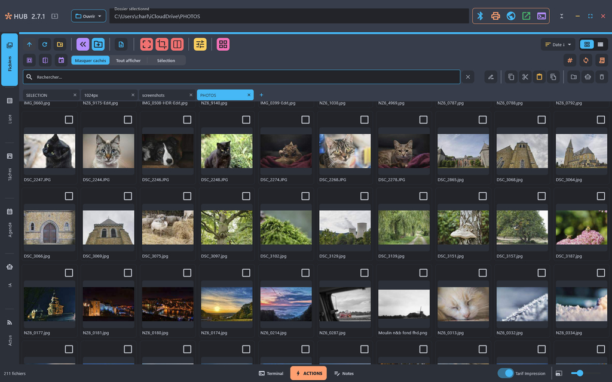
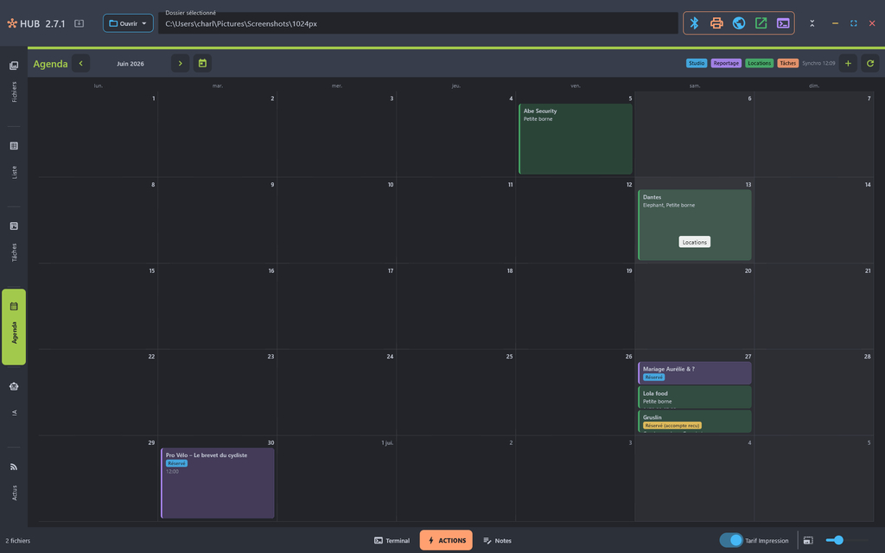

# Hub Image Manipulation

Poste de travail photo tout-en-un : trier, préparer, retoucher, recadrer, imprimer et livrer des photos en série, avec un assistant IA intégré.
Compatible **Windows**, **macOS** et **Linux**.





---

## Vue d'ensemble

Hub est organisé autour d'un **rail de surfaces** à gauche, d'une **barre de titre** (dossier, Bluetooth, impression, navigateur, terminal) et d'une **barre du bas** (Terminal, **Actions**, Notes, tarif d'impression, taille des vignettes).

| Surface | Rôle |
|---|---|
| Fichiers | Explorateur photo : onglets de dossiers, vignettes ou liste, recherche, tri, sélection, visionneuse plein écran, téléphones (MTP) et périphériques amovibles |
| Liste | Éditeur de fichiers `.json` (mots-clés, fiches produit…) |
| Tâches | Kanban des tâches de l'atelier, synchronisé avec Notion |
| Agenda | Calendrier mensuel des rendez-vous Studio, Reportages et Locations (Notion), avec cache local |
| IA | Assistant conversationnel (Gemini, Muse, modèles locaux) capable d'agir sur les fichiers |
| Actus | Lecteur de flux RSS/Atom |

Le **Bloc-notes** s'ouvre en bandeau depuis la barre du bas, et le **terminal intégré** affiche la progression de chaque outil (avec bouton d'arrêt).

---

## Fonctionnalités

### Gestion de fichiers

| Fonctionnalité | Description |
|---|---|
| Onglets | Plusieurs dossiers ouverts en onglets, restaurés au lancement |
| Navigation | Favoris, volumes montés, clés USB, cartes SD, boutons précédent/suivant de la souris |
| Téléphones | Parcourir et importer les photos d'un téléphone Android (MTP, Windows), avec « Tout copier » |
| Recherche | Filtrage en temps réel par nom de fichier |
| Tri | A→Z, Z→A, par date |
| Sélection | Multiple, inversion, tout sélectionner, filtrer sur la sélection, sélection par date |
| Copier / Couper / Coller | Presse-papiers interne entre dossiers et onglets |
| Dupliquer, Zipper, Renommer | Sur la sélection ; double-clic sur un `.zip` pour l'extraire |
| Rotation | 90° gauche/droite et 180°, sans perte de qualité visible |
| Impression | Impression directe et compteur d'exemplaires par image |
| Visionneuse | Plein écran, navigation au clavier, zoom, rotation, sélection, accès direct à Recadrage manuel et Retouche photo |

### Panneau Actions

Clic droit ou bouton **Actions** : toutes les opérations regroupées par étape du flux de travail.

| Catégorie | Outils |
|---|---|
| Fichier | Ouvrir dans un nouvel onglet, renommer, copier, couper, coller, dupliquer, zipper, ajouter à l'IA, rotations, imprimer, nombre d'impressions, supprimer |
| Préparation | Conversion JPG / PNG, PDF ou Word vers IDML, Renommer séquence, Renommer pages Affinity, Séparer RAW et JPG, Transfert vers TEMP, Rassembler sous-dossiers vers TEMP |
| Sélection | Déplacer la sélection ou les RAW vers SELECTION, copie selon score IA, Fichiers identiques, Comparaison |
| Kiosque | Interface de commande et d'impression pour bornes |
| Recadrage | Recadrage manuel, Recadrage automatique, 2 en 1 |
| Retouche | Retouche photo, Nettoyer métadonnées |
| Montage | Montage collage |
| Export & livrables | Redimensionner, Redimensionner + filigrane, Images en PDF, Livret (imposition piqûre à cheval), Remerciements |
| Maintenance | Nettoyer les anciens fichiers, Synchroniser avec un autre dossier |
| Ouvrir avec | Programmes externes configurables |

### Retouche photo

Développement par lot, façon Lightroom, avec une bande de miniatures et un rail d'onglets.

- **Réglages** : Lumière, Couleur, Virage, LUT, Netteté, Débruitage, effets pellicule (deux couches de grain, halation, bloom, aberrations chromatiques, désaturation des extrêmes), copyright. Boutons Auto, N&B, Blanc, Peau.
- **Réglages par image** : chaque photo garde ses propres réglages ; on les déploie sur **toutes** les images ou sur une **sélection** (cases à cocher sur les miniatures). Seules les photos retouchées sont traitées.
- **Masques** : masques locaux radiaux et linéaires (Lumière + Couleur), inversables, avec contour progressif.
- **Redresser** : on trace des lignes sur la photo, elles deviennent horizontales ou verticales (rotation + perspective), avec une force de 0 à 100 %.
- **IA** : amélioration (DeJPG), retouche par zone, suppression de fond.
- **Préréglages** : enregistrer et rappeler des réglages complets, masques compris.
- Enregistrement sur place, originaux conservés dans `ORIGINAUX/`.

### Recadrage manuel

Recadrage interactif aux formats photo professionnels (mm ou pixels, ratios libres) : rotation fine, zoom, grille, orientation, réglages de lumière et couleur, netteté, sortie (exemplaires, formats multiples, N&B, fit-in, bord blanc) et **fond IA** (suppression de fond blanc, gris ou flou, avec pipette d'ajout/retrait).

### Apps connexes

| App | Description |
|---|---|
| Comparaison | Deux dossiers côte à côte pour valider une sélection |
| Kiosque | Commandes et impression en boutique, avec tarifs |

### Assistant IA

L'IA (Gemini par défaut, Muse, ou modèles Ollama locaux) est intégrée directement dans Hub, dans sa propre surface (rail de gauche).

#### Capacités générales
- Chat texte et analyse d'images jointes
- Lecture de fichiers (`.txt`, `.md`, `.py`, `.json`, `.pdf`, `.docx`, `.csv`…)
- Recherche web (`web_search`) et lecture d'URLs (`fetch_url`)
- Mémoire persistante entre sessions (`memory.md`, `user.md`, `skills.md`, outil `update_memory_file`)
- Questions de clarification (`ask_clarifying_question`)

#### Outils fichiers (autonomes)
| Outil IA | Description |
|---|---|
| `list_folder_contents` | Lister le contenu d'un dossier avec taille et date |
| `read_file_content` | Lire le contenu d'un fichier texte |
| `create_file` | Créer ou modifier un fichier (crée les sous-dossiers si besoin) |
| `delete_files` | Supprimer des fichiers/dossiers (confirmation par défaut) |
| `move_file` | Déplacer ou renommer un fichier/dossier |
| `copy_file` | Copier un fichier ou dossier (récursif) |
| `create_folder` | Créer un dossier (mkdir -p) |
| `read_exif` | Lire les métadonnées EXIF (date, appareil, objectif, GPS…) |
| `zip_files` | Créer une archive ZIP |
| `unzip_file` | Extraire une archive ZIP |
| `organize_files` | Déplacer des fichiers vers des sous-dossiers thématiques |
| `analyze_images` | Analyser visuellement les images du dossier (chercher des critères) |
| `generate_image` | Générer une image depuis un prompt texte (Gemini image generation) |
| `edit_image` | Modifier une image existante via prompt texte |
| `iterate_image` | Améliorer une image en plusieurs passes (critique puis régénération) jusqu'à atteindre l'objectif |
| `score_photos` | Noter les photos d'un dossier pour aider au tri |
| `generate_music` | Générer un morceau de musique via Lyria 3 (30 s ou ~2 min) — sauvegardé en MP3 dans le dossier ouvert |
| `edit_file` | Remplacement chirurgical `old_string → new_string` dans un fichier (sans réécrire le fichier entier) |
| `read_file_lines` | Lire une plage de lignes précise d'un fichier (`start_line`, `end_line`). Indispensable pour les grands fichiers : utiliser `search_in_files` pour trouver les numéros de ligne, puis `read_file_lines` pour lire uniquement la section pertinente |
| `search_in_files` | Recherche regex récursive dans les fichiers, avec filtre glob et sensibilité à la casse |
| `find_files` | Recherche de fichiers par motif glob (`*.py`, `rapport*.pdf`…) |
| `git_command` | Commandes Git : status, log, diff, add, commit, push, pull, checkout… (liste blanche) |
| `manage_tasks` | Todo-list persistante en JSON (`.tasks.json`) avec états todo / in-progress / done |
| `read_pdf` | Extraction de texte PDF page par page (PyMuPDF prioritaire, pypdf en fallback) |
| `ask_subagent` | Déléguer une tâche à une instance IA distincte sans outils (recherche, synthèse, rédaction) |
| `schedule_task` | Planificateur OS — `schtasks` (Windows) / `crontab` (Linux-macOS) |
| `http_request` | Requêtes HTTP GET/POST/PUT/DELETE/PATCH avec headers et body personnalisés |
| `read_spreadsheet` | Lecture structurée de fichiers CSV, `.xlsx`, `.xls` et `.ods` |
| `run_terminal_command` | Exécuter des commandes shell (confirmation avant exécution en mode admin) |
| `ssh_command` | Exécuter une commande sur une machine distante via SSH |

#### Outils interface
| Outil IA | Description |
|---|---|
| `navigate_to_folder` | Ouvrir un dossier dans le navigateur de fichiers |
| `select_files_in_ui` | Sélectionner ou désélectionner des fichiers dans l'interface |
| `read_notepad` | Lire le contenu du bloc-notes intégré |
| `write_notepad` | Écrire dans le bloc-notes (remplacer, ajouter au début ou à la fin) |

#### Outils écran & contrôle système (computer use)
L'IA peut voir l'écran et interagir avec n'importe quelle application comme un utilisateur.

| Outil IA | Description |
|---|---|
| `take_screenshot` | Capturer l'écran (pyautogui). Paramètre optionnel `region` = `[x, y, largeur, hauteur]` pour capturer une zone précise et réduire la taille envoyée au modèle |
| `mouse_click` | Cliquer à une position `(x, y)`. Paramètres : `button` (`left`/`right`/`middle`), `clicks` (1 ou 2 pour double-clic) |
| `keyboard_type` | Saisir du texte dans le champ actif. Supporte l'unicode complet via le presse-papiers |
| `keyboard_hotkey` | Appuyer sur un raccourci clavier, ex. `["ctrl", "c"]`, `["command", "space"]`, `["alt", "F4"]` |

> Workflow typique : `take_screenshot` → identifier les coordonnées → `mouse_click` → `keyboard_type` / `keyboard_hotkey` → `take_screenshot` pour vérifier.

#### Synthèse vocale (TTS)
- Lecture automatique des réponses ou à la demande (bouton dédié)
- Mode **Live** (Gemini Live — voix naturelle et conversationnelle)
- Mode **Chunked** (lecture fidèle du texte, tous modèles)
- 10 voix au choix (Kore, Puck, Charon, Fenrir, Aoede, Leda, Orus, Zephyr, Schedar, Gacrux)

#### Modèles disponibles
| Modèle | Type | Vision |
|---|---|---|
| Gemini 3.8 Flash | Cloud Google | Oui |
| Muse Spark 1.3 | Cloud Meta (clé dans `~/.meta`) | Oui |
| Modèles Ollama | Local | Selon le modèle |

---

## Raccourcis clavier

### Hub (global)

| Raccourci | Action |
|---|---|
| Ctrl/Cmd + Haut | Afficher / masquer le terminal intégré |
| Ctrl/Cmd + Shift + Haut | Terminal en plein écran |
| Haut / Bas (champ terminal ou IA vide) | Rappeler les messages précédents |

### Gestion de fichiers

| Raccourci | Action |
|---|---|
| Ctrl/Cmd + A | Sélectionner / désélectionner tout |
| Ctrl/Cmd + I | Inverser la sélection |
| Ctrl/Cmd + C | Copier la sélection |
| Ctrl/Cmd + X | Couper la sélection |
| Ctrl/Cmd + V | Coller dans le dossier courant |
| Ctrl/Cmd + N | Créer un nouveau dossier |
| Ctrl/Cmd + R | Rafraîchir la prévisualisation |
| Ctrl/Cmd + D | Sélectionner tous les fichiers de la même date que le fichier de référence sélectionné |
| Delete | Supprimer la sélection |

### Visionneuse plein écran

| Raccourci | Action |
|---|---|
| Flèche gauche / droite | Image précédente / suivante |
| Échap | Fermer la visionneuse |

> Rotation, sélection, impression et accès à Recadrage manuel / Retouche photo restent disponibles via les boutons de la visionneuse.

---

## Installation

### Prérequis

- **Python 3.12+** — https://www.python.org/downloads/
- **ImageMagick** — requis pour la conversion d'images (Wand)

### Windows

1. Installer Python 3.12+ (cocher "Add Python to PATH").
2. Ouvrir le dossier du projet.
3. Double-cliquer sur `install.bat`.
4. Lancer avec `run.bat`.

### macOS / Linux

1. Installer Python 3.12+.
2. Ouvrir un terminal à la racine du projet.
3. Rendre les scripts exécutables (une seule fois) :

```bash
chmod +x install.sh run.sh
```

4. Lancer l'installation :

```bash
./install.sh
```

5. Lancer Hub :

```bash
./run.sh
```

### Ce que font les scripts d'installation

- Installent les dépendances Python (`requirements.txt`).
- Vérifient la présence d'ImageMagick et proposent l'installation si absent.
- Installent Ollama (IA locale) et téléchargent un modèle de base (`llama3.2:3b`).

### Dépendances optionnelles — onglet IA de Retouche photo

Les fonctionnalités d'inpainting, super-résolution et synthèse par patches (`retouche_ia.py`) nécessitent des paquets lourds (~5–10 GB) qui ne sont **pas** installés par défaut car ils entrent en conflit avec la version de Pillow utilisée par le reste de l'application (voir note dans `requirements.txt`).

Pour les installer manuellement dans un environnement isolé :

```bash
pip install -r requirements-augmentation.txt
```

> **Note :** IOPaint requiert `Pillow<10.0.0`, incompatible avec `Pillow>=10.0.0` requis par le reste de l'application. Cette fonctionnalité sera revue prochainement.

Pour SAM2 (segmentation interactive) :

```bash
pip install git+https://github.com/facebookresearch/sam2.git
```

Puis télécharger les modèles IOPaint :

```bash
iopaint download --model lama    # ~100 MB
iopaint download --model mat     # ~400 MB
```

---

## Utilisation de base

1. Ouvrir Hub.
2. Choisir un dossier avec `Ouvrir` (ou depuis les favoris).
3. Sélectionner les images à traiter.
4. Lancer l'outil voulu depuis la barre d'outils ou le panneau **Actions** (clic droit).
5. Suivre les logs dans le terminal intégré.

### Utiliser l'IA

- Ouvrir la surface IA depuis le rail de gauche.
- Poser une question, joindre des images, ou demander à l'IA de gérer des fichiers.
- L'IA peut naviguer dans vos dossiers, sélectionner des photos selon des critères visuels, créer des fichiers, archiver, analyser — sans intervention manuelle.
- Les suppressions de fichiers demandent une confirmation par défaut.
- La commande `/option` dans le chat ouvre le panneau de configuration de l'app.

---

## Mise à jour

La mise à jour s'effectue depuis le menu de l'application (bouton **Mise à jour** dans la barre du haut). Elle :
- Récupère les dernières modifications depuis le dépôt Git.
- Met à jour les dépendances Python si `requirements.txt` a changé.
- Propose un redémarrage automatique.

---

## Dépannage

### Python non détecté

Réinstaller Python depuis https://www.python.org/downloads/ et vérifier l'ajout au PATH.

### Erreur module manquant

Relancer simplement le script d'installation (`install.bat` ou `./install.sh`).

### ImageMagick absent

- Linux : `sudo apt install imagemagick` ou `sudo dnf install ImageMagick`
- macOS : `brew install imagemagick`
- Windows : https://imagemagick.org/script/download.php#windows (choisir `...-Q16-HDRI-x64-dll.exe`)

### Clé API Gemini

Définir la variable d'environnement `GEMINI_API_KEY` dans `.zshrc`, `.bashrc` ou un fichier `.env` à la racine du projet.

### Ollama non détecté

Installer depuis https://ollama.com/download puis relancer l'installation.

### Problème GPU / ONNX

Le script d'installation bascule automatiquement sur le backend CPU (`onnxruntime`) si aucun GPU compatible n'est détecté.
